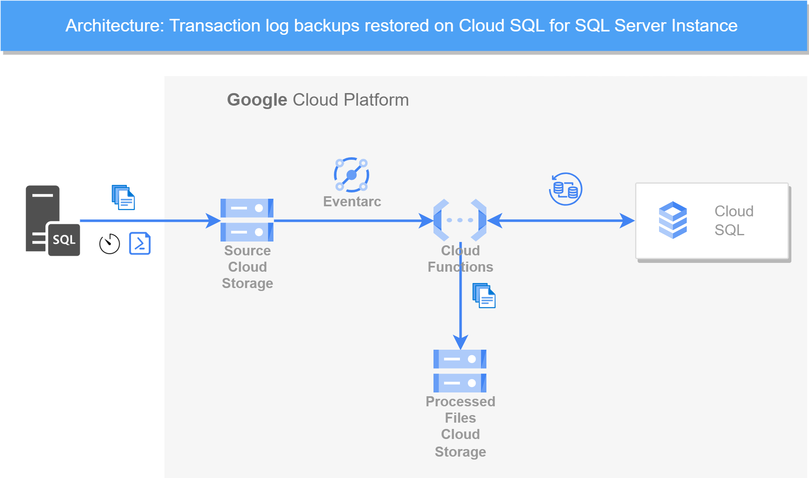

# Restore SQL Server Transaction log files to a Cloud SQL for SQL Server instance

This repository contains the implementation of an python function that restores transaction log backups uploaded to a cloud bucket to a database of an existing Cloud SQL for SQL Server instance.

## Restore functionality

You can import transaction log backups in Cloud SQL for SQL Server since [October 2023](https://cloud.google.com/sql/docs/release-notes#October_17_2023). This functionality helps when migrating to Cloud SQL using backups or setting up Cloud SQL for SQL Server DR instances. 

https://cloud.google.com/sql/docs/sqlserver/import-export/import-export-bak#import_transaction_log_backups

## Main workflow

The process starts when SQL Server transaction log backup files are being uploaded to a cloud bucket. These files may come from a SQL Server stand alone instance or CloudSQL for SQL Server.

The upload event fires an EventArc trigger that calls the python function. The function gets the path to the log file that was uploaded and constructs the request to restore the uploaded backup file to the Cloud SQL for SQL Server instance.

After the execution of the import request, the function checks periodically the progress of the restore operation. Once the status of the operation changes to "DONE", which means that it has an outcome, the function executes the following:

1. If the operation returns SUCCESS (determined by the absence of the 'error' element in the response json), then the function makes a copy of the backup file 'processed' storage bucket (if defined) and then finally deletes the file from the source storage bucket, thus signaling that the function processed the file successfully.

1. If the outcome of the operation returns ERROR, then depending on the details of the error response inside, the function implements one of the following decisions:

    * If the import failed with SQL Server error 4326 - too early to apply to the database - then the function assumes that the log file was processed already and deletes it from the bucket. The function returns an OK (200).

    * If the import failed with SQL Server error 4305 - too recent to apply to the database - the function assumes that there are some synchronization and schedules a later restore attempt of the same file, in the same execution run. The MAX_REQUEST_ATTEMPTS configuration parameter defines the maximum number of such retry attempts.  In this case, the function does not delete the file from the source bucket. In this way the function tries to compensate any upload order issues - for example later transaction log backups uploaded before earlier ones.

    * If the import fails for any other reason, the function schedules a later restore attempt in the same execution. The file is not deleted in case of errors.

The function can also restore full and differential backup files. To achieve this functionality, upload these files to the "full" respectively "diff" top level folders in the bucket. By default, the function restores backups with the norecovery option, leaving the database in a state to expect further sequential restores. 

If you need to switching to the DR Cloud SQL instance, the function must restore a backup file with the recovery option true. To do this,  simply create a "recovery" folder and upload the last log backup to that folder. This triggers the recovery option and leaves the database in the accessible state.

This repository also contains a powershell script for regularly uploading new files to cloud storage. The command to create a scheduled task in Windows to run it on a regular basis. For example, the scheduled task below script starts execution at 2:45 PM and runs every 5 minutes.

    schtasks /create /sc minute /mo 5 /tn "GCS Upload script" /tr "powershell <script_full_path>" /st 14:45 /ru <local_account_username> /rp 

Replace <script_full_path> with the path to your powershell script and <username> with a local user account with privileges to read and edit the settings.json files on your machine. You will be prompted to provide the password for the local <local_account_username> when you create the task.

The function must have defined a set of environment variables defined in the env.yml file. Details about them are described below, in the constraints section.

## Setup and configuration

1. Create a GCS bucket to upload your transaction log backup files:

        gcloud storage buckets create gs://<bucket-name> \
        --project=<project-id> \
        --location=BUCKET_LOCATION \
        --public-access-prevention

1. Use the gcloud describe command to get the service account information of your Cloud SQL Instance

        gcloud sql instances describe <CLOUD_SQL_INSTANCE_NAME>

Copy the value of the serviceAccountEmailAddress field. It should be something in the form of p******@gcp-sa-cloud-sql.iam.gserviceaccount.com.

1. Grant objectViewer rights for the CloudSQL service account on the bucket you just created:

        gsutil iam ch serviceAccount:<service-account-email-address>@gcp-sa-cloud-sql.iam.gserviceaccount.com:legacyBucketReader,objectViewer gs://<bucket-name>

1. Create a service account for the cloud function:

        gcloud iam service-accounts create cloud-function-sql-restore-log --display-name "Service Account for Cloud Function and SQL Admin API"

1. Create a role called Cloud SQL import that has rights to perform imports on Cloud SQL instances and can also orchestrate files on the buckets:

        export PROJECT_ID=`gcloud config get-value project`

        gcloud iam roles create cloud.sql.importer \
        --project ${PROJECT_ID} \
        --title "Cloud SQL Importer Role" \
        --description "Grant permissions to import and synchronize data from a cloud storage bucket to a Cloud SQL instance" \
        --permissions "cloudsql.instances.get, cloudsql.instances.import, eventarc.events.receiveEvent, storage.buckets.get, storage.objects.create, storage.objects.delete, storage.objects.get"

1. Attach the Cloud SQL import role to the Cloud function service account.

        gcloud projects add-iam-policy-binding ${PROJECT_ID} \
        --member="serviceAccount:cloud-function-sql-restore-log@${PROJECT_ID}.iam.gserviceaccount.com" \
        --role="projects/${PROJECT_ID}/roles/cloud.sql.importer"

1. Deploy the cloud function that triggers when a new object is uploaded to the bucket. The function will restore the full and transaction log backup files and also handle the file synchronization on the bucket.

- On your local development environment, install and initialize the gcloud CLI.

- Clone the sql server restore cloud function repository.

- Navigate to the restore-sql-server-transaction-logs/Function folder

- Edit the env.yml file according to your setup.

- From the restore-sql-server-transaction-logs/Function folder, run the following gcloud command to deploy the cloud function:

        gcloud functions deploy <YOUR_FUNCTION_NAME> \
        --gen2 \
        --region=<YOUR_REGION> \
        --runtime=<YOUR_RUNTIME> \
        --source=<YOUR_SOURCE_LOCATION> \
        --entry-point=<YOUR_CODE_ENTRYPOINT> \
        --env-vars-file=env.yml \
        --service-account cloud-function-sql-restore-log@alexcarciu-alloy-db-testing.iam.gserviceaccount.com

1. To invoke an authenticated cloud function, the underlying principal must have the invoker IAM permission. Assign the Invoker role (roles/run.invoker) through Cloud Run for 2nd gen functions to the function’s service account:

        gcloud functions add-invoker-policy-binding <YOUR_FUNCTION_NAME> \
        --region="<YOUR_REGION>" \
        --member="serviceAccount:cloud-function-sql-restore-log@${PROJECT_ID}.iam.gserviceaccount.com"

## Constraints and working assumptions:

1. The transaction log backup files are uploaded on a continuous, regular and batched manner to the cloud storage bucket. Ideally, the upload of the transaction log files happens in the same order as their creation time.

1. There special keyword folders in the bucket as follows:

    - all files under the top full folder will be treated as full backups
    - all files under the top diff folder will be treated as diff backups
    - any other files are treated as transaction log backups
    - all files under the recovery folder (wheter this folder is situated at the top level or nested under full or diff or any other folders) will be restored with the recovery option.

1. The files should follow a consistent naming scheme that includes certain elements. For example, an element describing the database name distinguishable by separators. The underscore character can be used as a separator"_". The function expects the separator and in the FILE_NAME_SEPARATOR respectively the DB_NAME_GROUP_POSITION environment variables. The DB_NAME_GROUP_POSITION works as a 1-based index, from left to right. 

    For example, if the transaction log backup files name use the following pattern:

        <instance_name>_<database-name>_<timestamp>.TRN

    The values for the FILE_NAME_SEPARATOR and DB_NAME_GROUP_POSITION look like this:

        FILE_NAME_SEPARATOR = "_"
        DB_NAME_GROUP_POSITION = "2"

1. As the function can also be used to restore full and differential backups, the transaction log backup files should be uploaded to any folder except the top folder "full" respectively "diff" (case insensitive) which is used for restoring full respectively differential backup files.

1. Define the environment variables in the env.yml file.

1. The service account role of the Cloud SQL Instance must have objectViewer rights on the source bucket.

1. The service account of the Cloud function has the following rights to import data from a cloud storage bucket to a Cloud SQL instance and to synchronize backup files on the upload and processed storage buckets:

    - cloudsql.instances.get
    - cloudsql.instances.import
    - eventarc.events.receiveEvent
    - storage.buckets.get
    - storage.objects.create
    - storage.objects.delete
    - storage.objects.get

## References

* [Eventarc triggers](https://cloud.google.com/functions/docs/calling/eventarc)

* [Deploy a Cloud Function](https://cloud.google.com/functions/docs/deploy)

* [Import data from a BAK file to Cloud SQL for SQL Server](https://cloud.google.com/sql/docs/sqlserver/import-export/import-export-bak#import_data_from_a_bak_file_to)

* [Recovery and the transaction log](https://learn.microsoft.com/en-us/sql/relational-databases/backup-restore/restore-and-recovery-overview-sql-server?view=sql-server-ver16#TlogAndRecovery)

