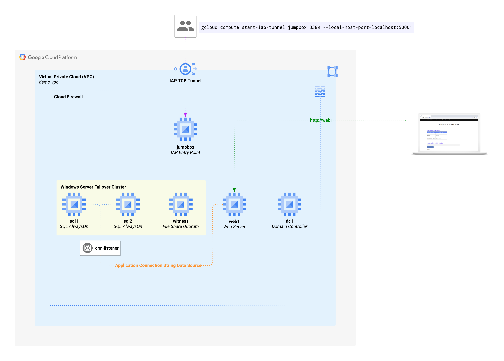
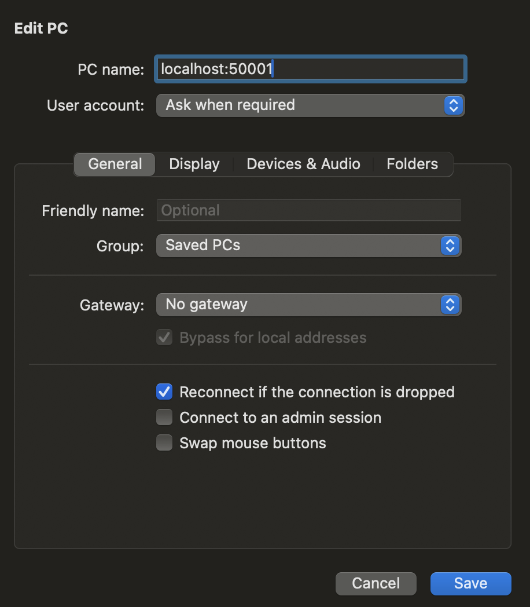
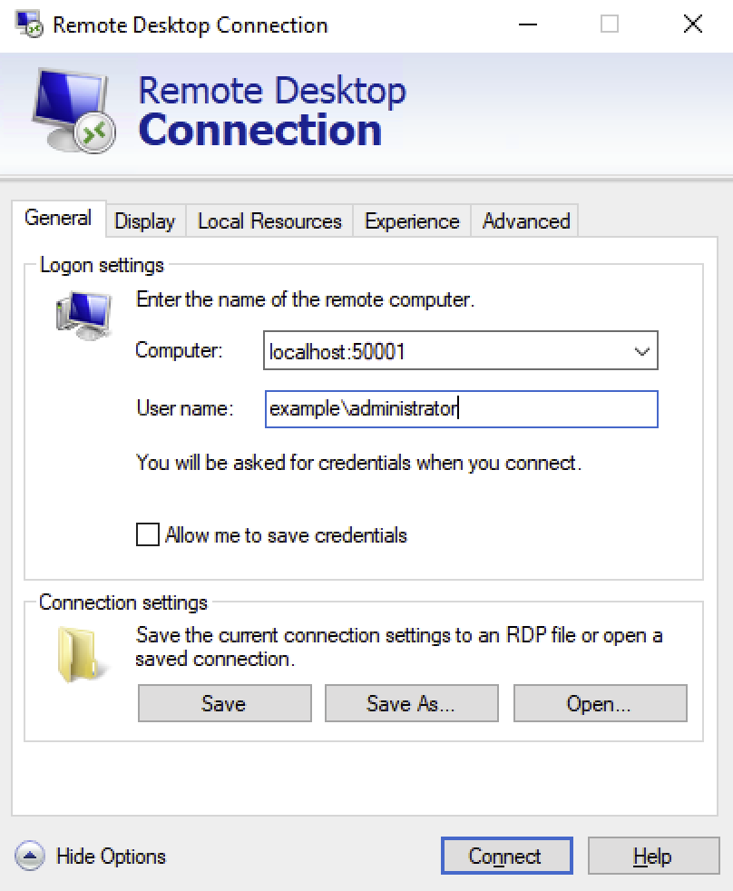
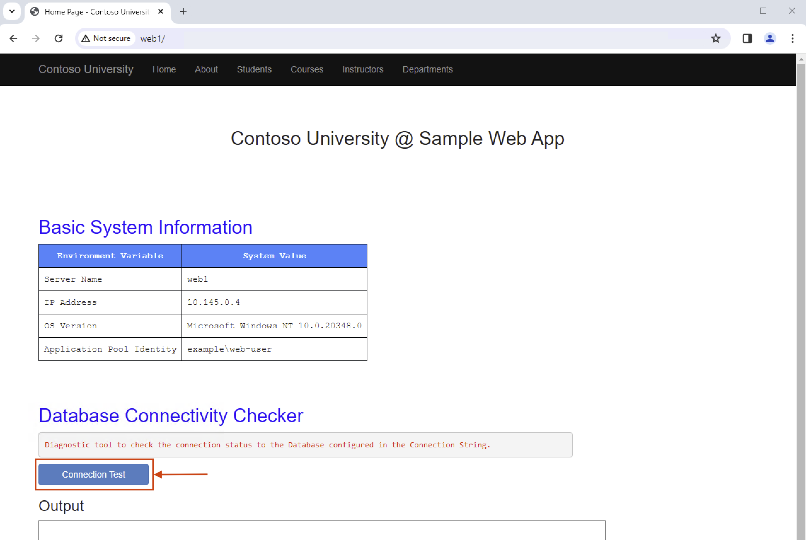
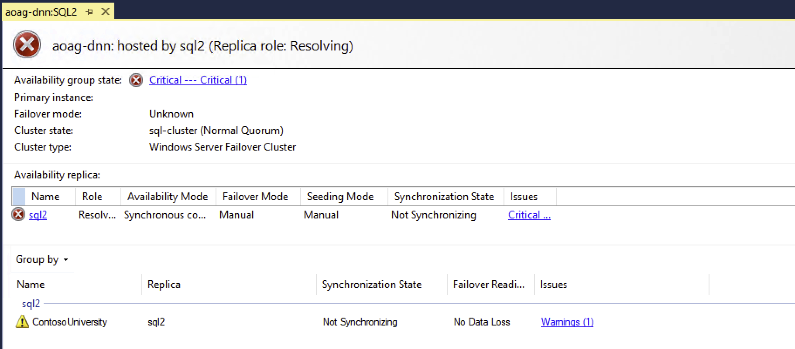
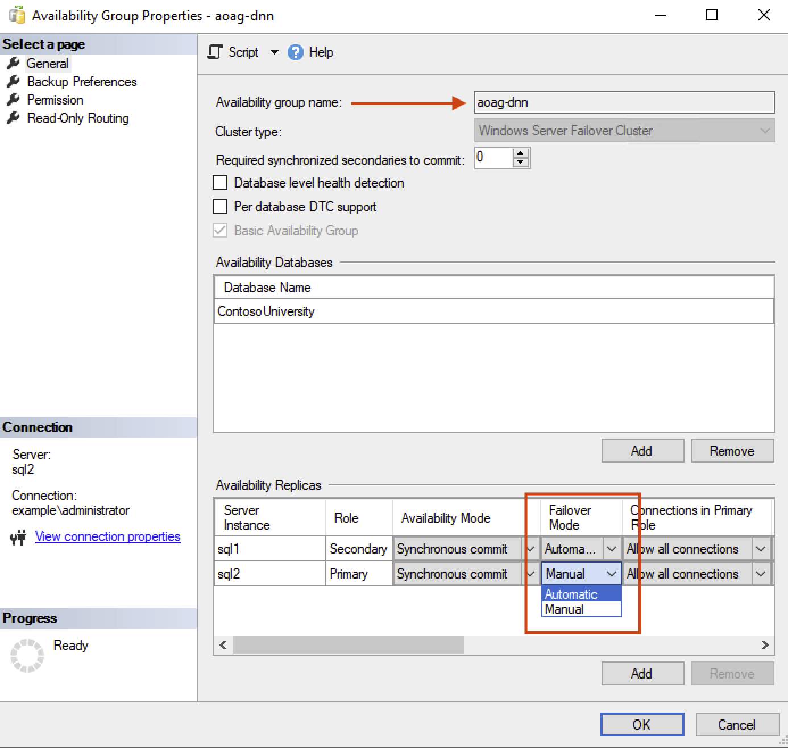

# SQL Server Distributed Network Name (DNN) Demo

### Table of Contents
* [Synopsis](#synopsis)
    - [Architecture Diagram](#architecture-diagram)
* [Setup - How To Use](#setup---how-to-use)
    - [User Requirements](#user-requirements)
    - [Project Requirements](#project-requirements)
    - [IAM Requirements](#iam-requirements)
    - [Terraform Requirements](#terraform-requirements)
* [Accessing the environment](#accessing-the-environment)
* [Simulating common issues in the environment](#simulating-common-issues-in-the-enviornment)
    - [Graceful failover](#graceful-failover)
    - [Simulated Databaes VM failure](#simulated-database-vm-failure)

## Synopsis

This demo creates a fully configured environment complete with an AlwaysOn Availability Group, DNN Listener and Web Server. The `variables.tf` file contains a list of default values used to configure the environment. You are not required to change the default values however, you may do so if you wish.

The only **required** variable change is the `provider_project` variable in the `terraform.tfvars` file.

In the pre-configured environment, you can examine the various components required for AlwaysOn such as Failover Clustering and Availability Groups in SQL Server.

You can also use the live Web Application running on the Web Server for testing scenarios like graceful failover or you can simulate a Server failure by resetting a SQL Server to see how the Web Application handles it.

The Web Application and Database are based on the [Contoso University](https://github.com/jjdelorme/ContosoUniversity) sample provided by @jjdelorme and @idofl.

#### Architecture Diagram



## Setup - How To Use

### User Requirements

1. You must have the [gcloud CLI](https://cloud.google.com/sdk/docs/install#windows) installed on your local machine
    - This demo uses [IAP for TCP forwarding](https://cloud.google.com/iap/docs/using-tcp-forwarding) and `gcloud` is required to establish the IAP Tunnel

### Project Requirements

>[!TIP]
> **Do not _enable any APIs_** after Project creation. 
> The terraform code will automatically enable the required APIs during provisioning.

1. Create a new Google Cloud Project and make note of the **_Project ID_**
    - Do not enable any APIs

2. Assign the IAM Roles listed below to the user that will be executing the code.

### IAM Requirements

> [!TIP]
> The _Easy Button_ option is to have **_Project Owner_** IAM role assigned to your user. This role will provide all functionality required to deploy the code.

The following _Project_ level IAM Roles are **required** for the user that is executing the demo.

1. [Editor](https://cloud.google.com/iam/docs/understanding-roles#editor)
    - `gcloud projects add-iam-policy-binding PROJECT_ID --member="user:USERNAME@DOMAIN.COM" --role="roles/editor"`

2. [Compute Instance Admin (v1)](https://cloud.google.com/compute/docs/access/iam#compute.instanceAdmin.v1)
    - `gcloud projects add-iam-policy-binding PROJECT_ID --member="user:USERNAME@DOMAIN.COM" --role="roles/compute.instanceAdmin.v1"`

3. [Service Account Admin](https://cloud.google.com/iam/docs/understanding-roles#iam.serviceAccountAdmin)
    - `gcloud projects add-iam-policy-binding PROJECT_ID --member="user:USERNAME@DOMAIN.COM" --role="roles/iam.serviceAccountAdmin"`

4. [Secret Manager Admin](https://cloud.google.com/secret-manager/docs/access-control#secretmanager.admin)
    - `gcloud projects add-iam-policy-binding PROJECT_ID --member="user:USERNAME@DOMAIN.COM" --role="roles/secretmanager.admin"`

5. [Role Administrator](https://cloud.google.com/iam/docs/understanding-roles#iam.roleAdmin)
    - `gcloud projects add-iam-policy-binding PROJECT_ID --member="user:USERNAME@DOMAIN.COM" --role="roles/iam.roleAdmin"`

6. [IAP-Secured Tunnel User](https://cloud.google.com/iap/docs/managing-access#roles)
    - `gcloud projects add-iam-policy-binding PROJECT_ID --member="user:USERNAME@DOMAIN.COM" --role="roles/iap.tunnelResourceAccessor"`

### Terraform Requirements

1. Navigate to the `terraform.tfvars` file and update the `provider_project` variable with your **_Project ID_**

2. Run the terraform flow
    - `terraform init`
    - `terraform validate`
    - `terraform plan -out tf.out`
    - `terraform apply tf.out`

> [!IMPORTANT]
> The deployment takes ~30 minutes to complete

## Accessing the environment

After the deployment has completed, you will see an output similiar to this:

```bash
  instructions_to_access_environment = <<-EOT
        Login to the Jumpbox Server using IAP.
        
                Credentials
                        Run this command> gcloud secrets versions access latest --secret=example-com-admin --project=example-project
        
                IAP Tunnel
                        Run this command> gcloud compute start-iap-tunnel jumpbox 3389 --local-host-port=localhost:50001 --zone=us-central1-f --project=example-project
        
                        After the Tunnel is established, use any RDP Client to connect to localhost:50001 and use the Credentials to authenticate to the Jumpbox.
    EOT
```

To access the environment, follow these steps:

1. Run the `gcloud` command provided in the output on your terminal. It is pre-populated with the correct variables for your deployment.
    - For example, if the **_Project ID_** was **_example-project_** and all the variables in `variables.tf` were left with the default values, the command to run would be:

    `gcloud secrets versions access latest --secret=example-com-admin --project=example-project`
    
    These credentials are for the Domain Administrator. You can use it to access all Servers in the environment.
     
    The command will return an output similiar to the following:
     
    ```bash
    $ gcloud secrets versions access latest --secret=example-com-admin --project=example-project
     WARNING:  Python 3.5-3.7 will be deprecated on August 8th, 2023. Please use Python version 3.8 and up.
     
    If you have a compatible Python interpreter installed, you can use it by setting
    the CLOUDSDK_PYTHON environment variable to point to it.
     
    Admin Username: example.com\administrator 
    Admin Password: EXAMPLE_PASSWORD 
    ```

2. Initiate the IAP Tunnel to the **_jumpbox_** Server for RDP access. Run the `gcloud` command provided in the output on your terminal.
    - For example, if the **_Project ID_** was **_example-project_** and all the variables in `variables.tf` were left with the default values, the command to run would be:

    `gcloud compute start-iap-tunnel jumpbox 3389 --local-host-port=localhost:50001 --zone=us-central1-f --project=example-project`
    
    After the Tunnel is successfully established, you will get a message similar to the following:
     
    ```bash 
    $ gcloud compute start-iap-tunnel jumpbox 3389 --local-host-port=localhost:50001 --zone=us-central1-f --project=example-project
    WARNING:  Python 3.5-3.7 will be deprecated on August 8th, 2023. Please use Python version 3.8 and up.
     
    If you have a compatible Python interpreter installed, you can use it by setting
    the CLOUDSDK_PYTHON environment variable to point to it.
     
    WARNING: 
     
    To increase the performance of the tunnel, consider installing NumPy. For instructions,
    please see https://cloud.google.com/iap/docs/using-tcp-forwarding#increasing_the_tcp_upload_bandwidth
     
    Testing if tunnel connection works.
    Listening on port [50001]. 
    ```
    
    Alternatively, you may consider using [IAP Desktop](https://github.com/GoogleCloudPlatform/iap-desktop?tab=readme-ov-file) to automate the connection.
  
3. Use any RDP client to connect to your local machine on the port specified. When prompted for the username and password, supply the credentials from Step (1) above.
    - For example, if the default command provided in the terminal output was run, you would use your RDP client to connect to **_localhost_** as the Server on Port **_50001_**.

    
    

4. After logging in to the **_jumpbox_** you will be able to connect to all of the Servers using the pre-configured RDP files on the Desktop. Use the same credentials from Step (1) above to login.

## Simulating common issues in the enviornment

### Graceful failover

1. From the **_jumpbox_** Desktop > Connect to **_web1_** using the Domain Administrator credentials

2. Launch Google Chrome and navigate to http://web1 (it takes a few seconds to load the first time)
    - Click on the **_Connection Test_** button > Review the output to see the connection string configuration.
      

    - Click on the **_Students_** tab (it takes a few seconds to load) > Click on **_Create New_**
        * Create a new Student record to validate that the Database connection is working
          After the new Student is created, use the Search bar to check that the Student record exists
terr
3. For your convenience, SQL Server Management Studio is installed on the Web Server
    - Open SSMS from the Desktop shortcut

    - In the **_Server Name_** field > Connect to the DNN Listener Name on the appropriate Port (default is `dnn-listener,6789`) > Click on **_Connect_**

    - Click on **_File_** > **_New_** > **_Query with Current Connection_**
        * Type the following query: `SELECT @@SERVERNAME` > Click on **_Execute_**
          Make note of the Server name (this is the current Primary in the AOAG)

    - Expand **_Always On High Availability_** > **_Availability Groups_** > Right click on ***aoag-dnn*** > Select **_Failover_**
        * Follow the Failover Wizard and connect to the Secondary replica (default is **_sql2_**) using the same credentials > Click on **_Finish_** to complete the Graceful failover

        Example SQL Query for failover
        ```sql
        :Connect dnn-listener,6789

        :Connect sql2

        ALTER AVAILABILITY GROUP [aoag-dnn] FAILOVER;
        ```

    - After the failover is complete, open a new Query window by clicking on **_File_** > **_New_** > **_Query with Current Connection_**
        * Type the following query: `SELECT @@SERVERNAME` > Click on **_Execute_**
          Make note of the Server name (this is the **new** Primary in the AOAG)


### Simulated Database VM failure

1. From the **_jumpbox_** Desktop > Connect to **_web1_** using the Domain Administrator credentials

2. Launch Google Chrome and navigate to http://web1 (it takes a few seconds to load the first time)
    - Click on the **_Connection Test_** button > Review the output to see the connection string configuration.

    - Click on the **_Students_** tab (it takes a few seconds to load) > Click on **_Create New_**
        * Create a new Student record to validate that the Database connection is working
          After the new Student is created, use the Search bar to check that the Student record exists

3. For your convenience, SQL Server Management Studio is installed on the Web Server
    - Open SSMS from the Desktop shortcut

    - In the **_Server Name_** field > Connect to the DNN Listener Name on the appropriate Port (default is `dnn-listener,6789`) > Click on **_Connect_**

    - Click on **_File_** > **_New_** > **_Query with Current Connection_**
        * Type the following query: `SELECT @@SERVERNAME` > Click on **_Execute_**
          Make note of the Server name (this is the current Primary in the AOAG)

4. Open a Command Prompt or Powershell Prompt and run the following command (assuming the defaults in `variables.tf` remain the same)
    - `gcloud compute instances stop sql1 --zone=us-central1-f`

5. After the command executes, you'll notice that you cannot connect to the AlwaysOn Availability Group because it is in a failed state despite the Availability Mode being set to Synchronous commit. 

   Using SSMS > Click on **Connect** > Type in **_sql2_** in the Server name field > Click on **Connect**

   When connected to **_sql2_** > Expand **Always on High Availability** > Expand **Availability Groups** > Right click on `aoag-dnn` > **Show Dashboard**

   
    - This is due to the **Failover Mode** being set to **Manual**. What this means is that while there is no data loss, an Administrator has to manually restore the AG after an unexpected failure takes place on the Primary replica.
        * From the AlwaysOn Dashboard > Click on **Start Failover Wizard** > Failover the AG to **_sql2_** and make sure it comes online.

    - To enable **Automatic Failover**, edit the Properties of the Availability Group and change the **Failover Mode** to **Automatic**.
      
        * After making the change to the **Failover Mode**, start back **sql1** (if you haven't already) then re-run the `gcloud` command to stop the new Primary (which should be **_sql2_**)
        
           `gcloud compute instances start sql1 --zone=us-central1-f`
        
           `gcloud compute instances stop sql2 --zone=us-central1-f`

        * After the command completes successfully, the Availability Group should automatic recover back to **_sql1_**
